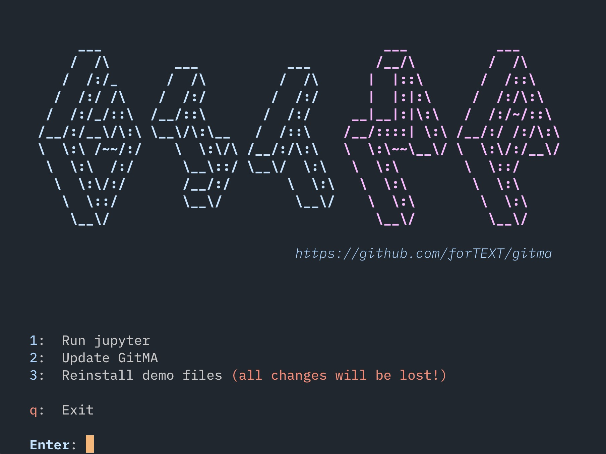

# GitMA-docker

Create a docker image, based on condaforge/miniforge3 and push it to docker hub. Get the image with:

```
docker pull gerstorfer/gitma-demo:latest
```

And run with: 

```
docker run -it --publish 8888:8888 --name gitma-demo gerstorfer/gitma-demo:latest 
```


